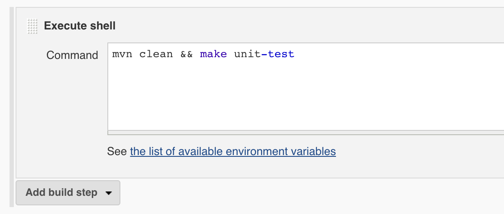
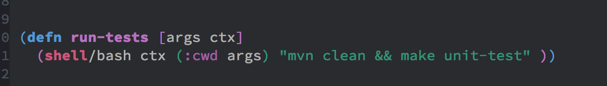
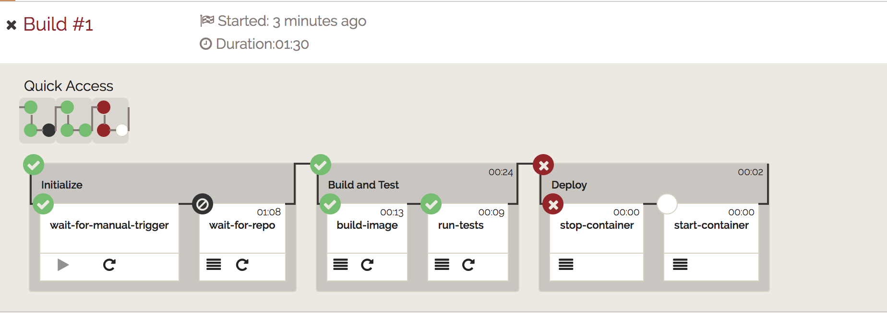

title: LambdaCD
controls: true
output: index.html
controls: false
style: basic-style.css

-- 
# LambdaCD
## Uma olhada freestyle

-- 
# Nós
Mateus: [@mrcambota]()

Rodrigo: [@rodrigomaia17]()

--
# CI?

--
# Por que o jenkins não resolve o nosso problema?

-- 
# Pipeline como código

-- 
## **Isso**

--
## **Vira isso**
</img>

--
## **E depois**
</img>

--
# **Histórico Tech Radar**

* **ADOPT** - Novembro 2016
* **ADOPT** - Hoje

-- 
# Outros

* aplicação clojure comum
* versionamento
* refactoring

--
# **Histórico Tech Radar**

* **ASSESS** - Novembro 2016
* **ASSESS** - Hoje

--
# GIMME CODE!
